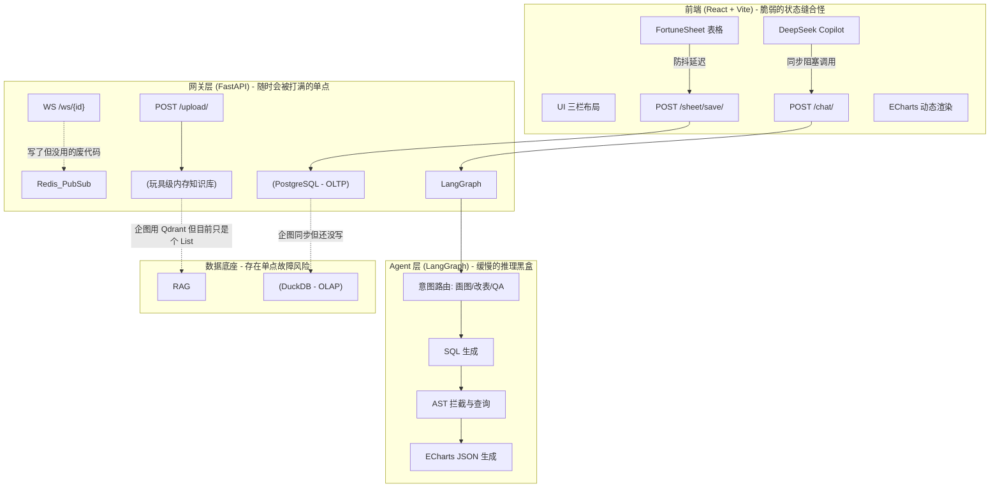

# 🗑️ ai-Form: 披着“企业级”外衣的半成品 AI-BI 工作区
## ⚠️ 极其严肃的警告 (WARNING)
别被文档里吹嘘的“Multi-Agent”、“HTAP读写分离”、“CQRS架构”骗了。目前这只是一个用胶水代码、硬编码和 setTimeout 勉强粘合起来的 MVP（最小可行性玩具）。
本系统目前极度脆弱，毫无鲁棒性可言，毫无高并发承载能力。绝对不要将其部署到任何生产环境中，否则你的数据将在大模型的幻觉和前端的幽灵重渲染中灰飞烟灭。

## 🏗️ 所谓“完整”的架构图 (Architecture Illusion)
这是一张画大饼的架构图。图上画得很美，但实际上中间件（Celery/Redis/DuckDB）目前全在“摸鱼”或者根本没接入，真实的流量全靠 FastAPI 单节点同步阻塞硬抗。



## 📂 目录结构树与文件内部剖析 (Directory Structure & Code Debt)
不要被看似规范的 DDD（领域驱动设计）目录骗了。里面充斥着过度耦合的逻辑和待重构的技术债。
```Plaintext

📦 ai-Form
 ┣ 📂 frontend                 # 前端微服务 (MFE 多前端微应用)
 ┃ ┣ 📂 src
 ┃ ┃ ┣ 📂 components
 ┃ ┃ ┃ ┗ 📜 DataCanvas.jsx   ⭕️ [进行中] 
 ┃ ┃ ┃    - 目标状态：完整的企业级电子表格，支持底层单元格级别的防抖双向绑定、历史状态快照(Undo/Redo 树对接后端)、鼠标框选区域坐标提取。
 ┃ ┃ ┃    - 当前状态：已解决绝对定位 CSS 塌陷；通过 window.addEventListener 监听了高亮/应用/拒绝事件。
 ┃ ┃ ┃    - 🛑 悲观痛点：**极其脆弱！** 目前通过 `workbookRef.current.setCellValue` 强行改 DOM 数据，极其容易与 FortuneSheet 内部的状态机冲突，导致你看到的“表格没修改”现象；未实现空间坐标获取；未实现真正的时光机快照流。
 ┃ ┃ ┣ 📂 hooks
 ┃ ┃ ┃ ┗ 📜 useAgentSocket.js✅ [已完成]
 ┃ ┃ ┃    - 目标状态：封装高内聚、低耦合的全双工通信钩子。
 ┃ ┃ ┃    - 当前状态：完美实现了状态机 (idle/processing/success/error) 与 WebSocket 实例的管理。
 ┃ ┃ ┣ 📂 pages
 ┃ ┃ ┃ ┣ 📜 ProjectHall.jsx  ⭕️ [进行中]
 ┃ ┃ ┃ ┃  - 目标状态：企业级项目大厅，支持分页、团队鉴权、工作区增删改查。
 ┃ ┃ ┃ ┃  - 当前状态：实现了基础的居中网格布局与真实的 CRUD 接口对接。
 ┃ ┃ ┃ ┃  - 🛑 悲观痛点：缺少分页加载；没有接入真实的用户认证 (JWT/SSO) 机制；删除操作没有二次验证弹窗组件（目前用的是原生的 `window.confirm`，不符合企业规范）。
 ┃ ┃ ┃ ┗ 📜 WorkspaceView.jsx⭕️ [进行中]
 ┃ ┃ ┃    - 目标状态：基于 GridStack 的全动态拖拽 BI 画布、多表联动、AI Human-in-the-loop (Apply/Reject) 机制。
 ┃ ┃ ┃    - 当前状态：实现了左右自适应拖拽、工作表切换、AI 消息流式上屏与 Apply/Reject UI。
 ┃ ┃ ┃    - 🛑 悲观痛点：**BI 画布完全不合格！** ECharts 目前仅仅是绑定在一个 `div` 上，没有接入 `GridStack`，无法拖拽排版；图表时常因为 React 生命周期问题导致空白；省略号二级菜单虽然存在，但状态管理存在重影 Bug。
 ┃ ┃ ┣ 📜 App.jsx            ✅ [已完成]
 ┃ ┃ ┃    - 目标状态：纯净的路由分发网关 (react-router-dom)。
 ┃ ┃ ┣ 📜 App.css/index.css  ✅ [已完成]
 ┃ ┃ ┃    - 目标状态：清除 Vite 默认污染，构建 100vw/100vh 工业级 Reset。
 ┃ ┃ ┗ 📜 main.jsx           ✅ [已完成] 
 ┣ 📂 backend                  # 后端核心服务 (FastAPI / DDD 领域驱动设计)
 ┃ ┣ 📂 app
 ┃ ┃ ┣ 📂 core               
 ┃ ┃ ┃ ┗ 📜 config.py        ✅ [已完成]
 ┃ ┃ ┣ 📂 agents             # 多智能体编排引擎 (LangGraph)
 ┃ ┃ ┃ ┣ 📜 reviewer.py      ⭕️ [进行中]
 ┃ ┃ ┃ ┃  - 目标状态：AST 解析终极风控防火墙，隐式注入 `tenant_id` 保证租户隔离。
 ┃ ┃ ┃ ┃  - 当前状态：实现了基础的 DDL/DML (DROP, DELETE 等) 节点拦截。
 ┃ ┃ ┃ ┃  - 🛑 悲观痛点：多租户隔离方法 `_inject_tenant_isolation` 虽然写了，但目前没有任何接口真正去调用它，存在严重的数据越权越权风险。
 ┃ ┃ ┃ ┣ 📜 workflow.py      ✅ [已完成]
 ┃ ┃ ┃ ┃  - 目标状态：带循环边 (Conditional Edges) 的有向无环图，包含失败重试。当前已实现。
 ┃ ┃ ┃ ┣ 📜 nodes.py         ⭕️ [进行中]
 ┃ ┃ ┃ ┃  - 目标状态：完全基于 OpenAI Tool Calling 规范的结构化输出；物理级表结构动态感知；脱敏级 BI 渲染。
 ┃ ┃ ┃ ┃  - 当前状态：接入了动态 DuckDB Schema 感知。
 ┃ ┃ ┃ ┃  - 🛑 悲观痛点：**AI 智障的罪魁祸首！** 放弃了 `bind_tools`，改用了脆弱的正则 `extract_json_from_text` 强行提数据。只要大模型发神经少写个引号或括号，链路瞬间抛出 `NoneType` 异常导致崩溃；Prompt 对 ECharts 的要求不够精准，导致前端图表无法渲染。
 ┃ ┃ ┃ ┗ 📜 state.py         ✅ [已完成]
 ┃ ┃ ┃    - 目标状态：全局上下文定义。加入了 `error_msg` 和 `retry_count` 支撑流转。
 ┃ ┃ ┣ 📂 models             
 ┃ ┃ ┃ ┣ 📜 crud.py          ❎ [当前为空]
 ┃ ┃ ┃ ┃  - 目标状态：封装复杂的数据库事务，如防抖合并、提交历史快照。
 ┃ ┃ ┃ ┃  - 🛑 悲观痛点：这是 DDD 架构的耻辱柱！目前的数据库增删改查全部像意大利面条一样堆在 `endpoints.py` 里。
 ┃ ┃ ┃ ┗ 📜 schema.py        ⭕️ [进行中]
 ┃ ┃ ┃    - 目标状态：包含 User, Workspace, SheetData, History_Log 的完整 HTAP 库表映射。
 ┃ ┃ ┃    - 当前状态：仅实现了 `Workspace` 和 `SheetData` (JSONB)。
 ┃ ┃ ┃    - 🛑 悲观痛点：缺失 `History_Log` 表，导致前端点击 Undo/Redo 永远无法从后端拉取到真实时光机快照。
 ┃ ┃ ┣ 📂 api                
 ┃ ┃ ┃ ┣ 📂 v1
 ┃ ┃ ┃ ┃ ┣ 📜 websockets.py  ⭕️ [进行中]
 ┃ ┃ ┃ ┃ ┃  - 目标状态：与 Redis Pub/Sub 绑定的全双工通信中枢。
 ┃ ┃ ┃ ┃ ┃  - 当前状态：实现了连接管理池。
 ┃ ┃ ┃ ┃ ┃  - 🛑 悲观痛点：`websockets.py` 自身并没有挂载监听，完全依赖 `event_bus.py` 去推数据，遇到并发断线时容易引发僵尸连接。
 ┃ ┃ ┃ ┃ ┗ 📜 endpoints.py   ⭕️ [进行中]
 ┃ ┃ ┃ ┃    - 目标状态：极度轻量的 API 网关。
 ┃ ┃ ┃ ┃    - 当前状态：打通了 `/chat/` 的 202 异步任务投递。加入了项目大厅 CRUD。
 ┃ ┃ ┃ ┃    - 🛑 悲观痛点：代码行数爆炸，严重违背单一职责原则；`/sheet/save/` 接口还是同步写数据库后再触发同步任务，并发一高依然会卡死网关。
 ┃ ┃ ┣ 📂 worker             
 ┃ ┃ ┃ ┣ 📜 celery_app.py    ✅ [已完成]
 ┃ ┃ ┃ ┃  - 目标状态：消费长耗时任务，已通过 `run_chat_workflow_task` 接入真实 LangGraph 并广播结果。
 ┃ ┃ ┃ ┗ 📜 htap_sync.py     ⭕️ [进行中]
 ┃ ┃ ┃    - 目标状态：后台定期将 PG 的 JSONB 展平转储为 Arrow 格式同步给 DuckDB。
 ┃ ┃ ┃    - 当前状态：跑通了 Pandas -> Arrow 的单向链路。
 ┃ ┃ ┃    - 🛑 悲观痛点：每次同步都是 `DROP TABLE` 暴力全量覆盖！数据量一旦超过 10 万行，系统直接内存溢出宕机。缺乏增量同步机制。
 ┃ ┃ ┣ 📂 services           
 ┃ ┃ ┃ ┣ 📜 vector_store.py  ❎ [当前为空]
 ┃ ┃ ┃ ┃  - 目标状态：封装 Qdrant/Milvus。
 ┃ ┃ ┃ ┃  - 🛑 悲观痛点：知识库仍在使用全局内存列表 `global_knowledge_base`，重启服务器直接丢失所有用户上传的文档数据。
 ┃ ┃ ┃ ┣ 📜 document_parser.py ⭕️ [进行中]
 ┃ ┃ ┃ ┃  - 目标状态：LangChain 文档分块。
 ┃ ┃ ┃ ┃  - 当前状态：仅使用 PyMuPDF 强行截断前 3000 字。
 ┃ ┃ ┃ ┣ 📜 event_bus.py     ✅ [已完成]
 ┃ ┃ ┃ ┃  - 目标状态：Redis Pub/Sub 异步总线，已跑通并做好了异常拦截。
 ┃ ┃ ┃ ┗ 📜 query_executor.py✅ [已完成]
 ┃ ┃ ┃    - 目标状态：对接物理落盘的 DuckDB 执行聚合查询。
 ┃ ┃ ┗ 📜 main.py            ✅ [已完成] 
 ┣ 📂 deploy                 ❎ [当前为空]
 ┃ ┣ 📜 Dockerfile           - 缺失。
 ┃ ┣ 📜 docker-compose.yml   - 缺失。
 ┃ ┗ 📜 nginx.conf           - 缺失。


```

📉 客观差距分析 (Gap Analysis / The Harsh Reality)
如果你想接手这个项目，请先了解你要面对的烂摊子：

1. 虚假的“异步通信” (Fake Asynchronous)
号称采用了 Celery + Redis Pub/Sub + WebSocket 的高并发全双工架构。实际上： 右侧 Copilot 聊天调用的是极度原始的 HTTP POST ``。大模型思考 10 秒，前端就得傻等 10 秒，FastAPI 的 worker 进程就被白白挂起 10 秒。

2. 玩具级的 RAG 知识库 (Toy-Level RAG)
所谓的知识库，仅仅是在后端内存里定义了一个全局变量 global_knowledge_base = [] ``。

没有持久化：只要重启服务器，所有上传的 PDF 全部清空。

没有向量化 (Embedding)：没有 Qdrant，没有 Milvus。它仅仅是把 PDF 拍平截取前 3000 字，然后暴力拼接到 Prompt 里发送给 DeepSeek。一旦文件稍微长一点，立刻触发大模型 Token 上限报错。

3. 千疮百孔的 FortuneSheet (Fragile Spreadsheet)
虽然在 DataCanvas.jsx 中利用 delete sheet.celldata 和 setTimeout 强行阻断了由于开源组件自身设计缺陷带来的“白板覆盖死循环” ``，但这种基于定时器的防御机制极其脆弱。网络稍微抖动，依然存在数据被洗白的风险。

4. 纸上谈兵的 HTAP 读写分离 (Vaporware HTAP)
吹嘘了“PostgreSQL 存事务，DuckDB 做极速分析”。目前的现状是：DuckDB 根本没接进来，大模型生成的查询大概率直接砸在无辜的事务数据库上（或者只是基于微小的假数据在做过家家）。

🎯 结论
这是一个典型的“为了证明可行性而牺牲一切工程严谨性”的堆砌产物。如果作为毕业设计或者技术验证原型，它勉强够格；如果想拿去商业化或应对真实的复杂业务，建议直接 rm -rf 从头重构基础设施。


